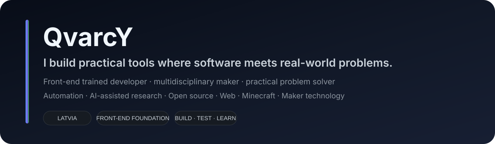

<picture>
  <source media="(prefers-color-scheme: dark)" srcset="./assets/hero-dark.svg">
  <source media="(prefers-color-scheme: light)" srcset="./assets/hero-light.svg">
  
</picture>

 

---

### Hello, I'm Ingars / QvarcY 👋

I'm a curiosity-driven maker from Latvia.

I'm not tied to one programming language, framework, or field. What interests me is the space between **"this is annoying"** and **"this could work better."** That usually leads me to build something.

Sometimes it's a research engine. Sometimes a desktop tool for 3D-printing workflows. Sometimes a PrestaShop module, a Minecraft automation utility, a laser/CAD experiment, or a small script that removes repetitive work.

> **I build practical tools where software meets real-world problems.**

---

### 🧰 Tech I work with

<picture>
  <source media="(prefers-color-scheme: dark)" srcset="https://skillicons.dev/icons?i=python,ts,js,nodejs,php,html,css,tailwind,git,github,linux,windows,vscode&theme=dark">
  <source media="(prefers-color-scheme: light)" srcset="https://skillicons.dev/icons?i=python,ts,js,nodejs,php,html,css,tailwind,git,github,linux,windows,vscode&theme=light">
  
</picture>

---

### 🚀 Featured projects

<strong>🔎 Sprīdītis</strong> — AI-assisted research engine

 

**AI-assisted research engine with structured evidence and research memory.**

Sprīdītis explores the web, discovers sources, collects structured evidence, remembers how useful information was found, and is being built to make future research runs smarter than previous ones.

**Focus** · `Python` · `Research Automation` · `Web Crawling` · `Evidence` · `AI-assisted Analysis`

**Current public baseline** · `v3.3.0-alpha.7`

<a href="https://github.com/QvarcY/spriditis"><strong>View project →</strong></a>

<strong>🛡️ PrintGuardian</strong> — Know before you print

 

A local-first Windows desktop tool for inspecting `.3mf` projects from Bambu Studio and OrcaSlicer before printing.

It highlights settings worth checking, compares projects with trusted profiles, supports selected safe corrections, and exports a verified copy without overwriting the original.

**Focus** · `TypeScript` · `Tauri` · `3MF` · `3D Printing` · `Local-first`

**Current public preview** · `v0.3.0-preview.1`

<a href="https://github.com/QvarcY/PrintGuardian"><strong>View project →</strong></a>

<strong>🛒 PrestaShop Meta Pixel Bridge</strong> — privacy-aware tracking

 

A free, privacy-aware Meta Pixel integration for PrestaShop 8 with consent gating and ecommerce events — without requiring a SaaS subscription.

**Focus** · `PHP` · `PrestaShop 8` · `E-commerce` · `Privacy`

<a href="https://github.com/QvarcY/prestashop-meta-pixel-bridge"><strong>View project →</strong></a>

<strong>⛏️ Minecraft ALT Manager</strong> — automation playground

 

A Windows application for Minecraft Java ALT / AFK accounts with automated login, workflows, reconnect handling and server switching.

Built around Mineflayer to make repetitive account automation easier to manage.

**Focus** · `Mineflayer` · `Node.js` · `PowerShell` · `Minecraft Automation`

<a href="https://github.com/QvarcY/minecraft-alt-manager"><strong>View project →</strong></a>

---

### 🧪 Open-source exploration

Not every repository needs to become a product. GitHub is also where I test ideas, contribute, learn and occasionally take a small experiment much further than originally planned.

<strong>SAFE-check</strong> — source-aware argument fidelity

 

Exploration around source-aware argument fidelity, evidence quality, provenance and auditable reasoning.

<a href="https://github.com/QvarcY/SAFE-check"><strong>Explore SAFE-check →</strong></a>

<strong>PrestaShop Visitor Journey Tracker</strong> — lightweight tracking

 

Lightweight visitor journey, referrer and logged-in customer tracking for PrestaShop 8.

<a href="https://github.com/QvarcY/prestashop-8-visitor-journey-tracker"><strong>Explore tracker →</strong></a>

---

### 🔭 What I keep exploring

- **Automation** — remove repetition
- **AI-assisted tools** — assist, don't obscure
- **Research systems** — evidence over guesses
- **Web & e-commerce** — useful real-world workflows
- **Minecraft** — automation playground
- **Maker tech** — 3D printing · laser engraving · CAD
- **Open source** — learn, share and improve

---

### 🛠️ How I like to build

**01** Find a real problem
**02** Understand the process
**03** Build the smallest useful solution
**04** Test it in real use
**05** Improve what actually matters

 

**Practical first** · A tool should solve an actual problem, not exist only as a technical demonstration.

**Understandable by design** · Useful software should explain what it is doing instead of hiding everything behind a black box.

**Safe by default** · Original files, user data and existing workflows should not be casually destroyed or overwritten.

**Local-first when practical** · Not every problem needs another cloud dependency, subscription or external service.

**Open where it makes sense** · If something can help other people, I like the idea of making at least part of it available to explore, reuse or improve.

---

### 💡 The idea behind most of my projects

A lot of them start with one of these:

> **"Why does this have to be so complicated?"**

or

> **"Could this be done better?"**

Sometimes the answer becomes a tiny script. Sometimes it becomes a full application.

Either outcome is useful if I learned something, removed friction, or made the original problem easier to solve.

---

### Explore · Build · Test · Improve

Practical tools, experiments and open-source work by QvarcY.

  

<a href="https://kas.id.lv/portfolio/">Portfolio</a>
&nbsp;·&nbsp;
<a href="https://github.com/QvarcY?tab=repositories">Repositories</a>
&nbsp;·&nbsp;
<a href="https://craftin.lv/">CraftIN</a>
&nbsp;·&nbsp;
<a href="https://buymeacoffee.com/craftin">Support my work</a>

