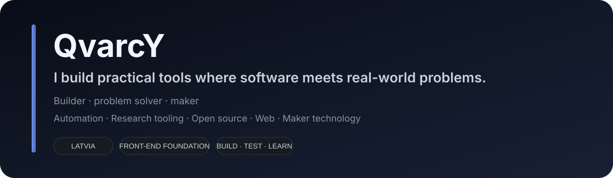

<!-- ═══════════════════════════════════════════════════════════
     QvarcY · GitHub Profile
     Builder · Problem Solver · Maker
     ═══════════════════════════════════════════════════════════ -->

<!-- ░░ HERO · LOCAL DARK/LIGHT ░░ -->
<picture>
  <source media="(prefers-color-scheme: dark)" srcset="./assets/hero-dark.svg">
  <source media="(prefers-color-scheme: light)" srcset="./assets/hero-light.svg">
  
</picture>

<!-- ░░ IDENTITY · ONLY ANIMATED ELEMENT ░░ -->

 

<!-- ░░ LINKS ░░ -->

#### ⟡ Hi, I'm Ingars / QvarcY ⟡

**Latvia**

*I like understanding how things work, finding friction in real processes, 
and building practical solutions around it.*

I work across **software**, **automation**, **research tools**, 
**open source** and **maker technology**.

I prefer choosing the tool that fits the problem 
rather than staying inside one stack.

`Understand the problem. Build what is useful. Simplify what does not need to be complicated.`

<!-- ═══════════════════════════════════════════════════════════
     PRINCIPLES · LOCAL ICONS · NO EXTERNAL BADGES
     ═══════════════════════════════════════════════════════════ -->

<table align="center" width="100%">
<tr>

<td align="center" width="25%">
  
    
  <strong>BUILD</strong>
   
  practical tools
</td>

<td align="center" width="25%">
  
    
  <strong>EXPLORE</strong>
   
  how systems work
</td>

<td align="center" width="25%">
  
    
  <strong>SIMPLIFY</strong>
   
  awkward workflows
</td>

<td align="center" width="25%">
  
    
  <strong>MAKE</strong>
   
  digital + physical
</td>

</tr>
</table>

#### ⟡ TOOLS I USE ⟡

Tools change. Problems change. 
The goal stays the same: use what fits.

 

<strong>◈ &nbsp; Development & Automation</strong>

 

*Used for building utilities, automation, research tooling, web systems and experiments.*

<strong>◇ &nbsp; Web & Data</strong>

 

*Interfaces, APIs, data flows, databases, web applications and e-commerce systems.*

<strong>△ &nbsp; Platforms & Workflow</strong>

 

*Tools for building, testing, troubleshooting, releasing and running things.*

<strong>⌘ &nbsp; Maker & Physical Tech</strong>

 

*Prototyping, fabrication and solving physical problems with software + hardware together.*

#### ⟡ BACKGROUND ⟡

My formal software-development foundation includes the 
**Meta Front-End Developer Professional Certificate.**

That foundation still influences how I approach interfaces, structure and usability, 
while my interests have expanded far beyond front-end development.

<!-- ═══════════════════════════════════════════════════════════
     AUTOMATIC GITHUB SIGNALS
     ═══════════════════════════════════════════════════════════ -->

#### ⟡ GITHUB ⟡

Repositories, pinned work and contribution activity tell the rest of the story.

### ⟡ SUPPORT THE WORK ⟡

**Did one of my tools, fixes, or contributions save you time?**

GitHub Sponsors helps me keep building and maintaining practical open-source tools. 
No paywalls, no locked fixes — just optional support if the work is useful to you.

  

<!-- ═══════════════════════════════════════════════════════════
     FOOTER · IDENTITY CORE
     ═══════════════════════════════════════════════════════════ -->

 

**BUILD · SOLVE · MAKE**

QvarcY · Latvia · practical tools for real-world problems

